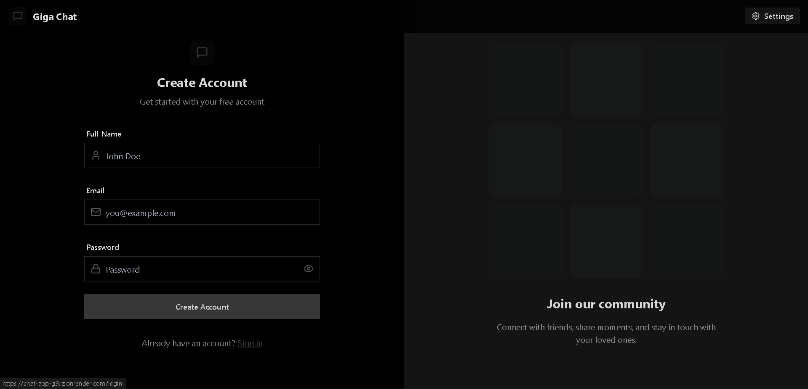
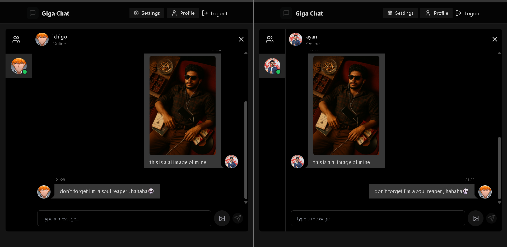
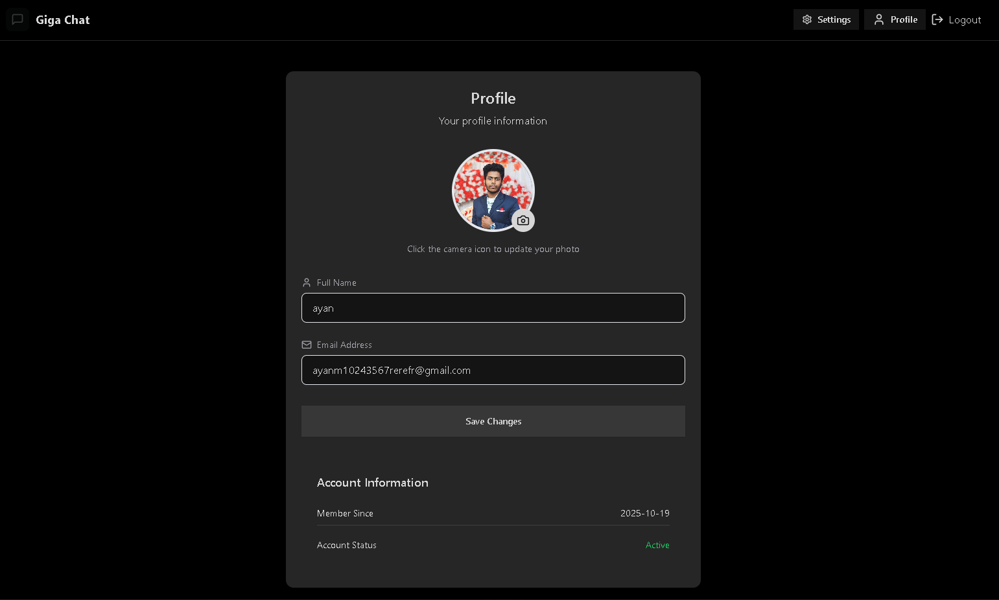
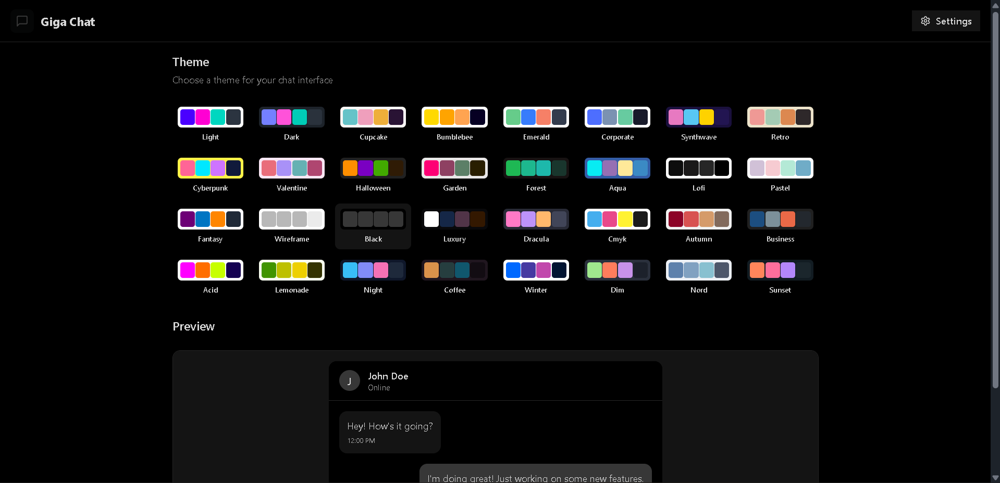

# 💬 MERN Chat Application

A **real-time chat application** built using the **MERN stack (MongoDB, Express, React, Node.js)** with **Socket.IO** for instant messaging.  
Users can log in, chat in real-time, update profiles, and personalize themes — all with a modern, responsive UI.

---

## ✨ Features

- 🔐 User Authentication (JWT + bcrypt)  
- 💬 Real-time Messaging with Socket.IO  
- 📸 Image Uploads via Cloudinary  
- 🎨 Theme Customization (Dark/Light)  
- 🧍 User Profiles & Avatars  
- ⚡ Typing Indicator & Online Status  
- 🧾 Chat History Persistence  

---

## 🖼️ Screenshots

### Login Page

### Home Page

### Profile Page

### Theme Settings Page

---

## 🧑‍💻 Author

**Ayan** – Engineering Student | Web Developer + AI Engineer  
🌐 [GitHub](https://github.com/Ayan1024)
